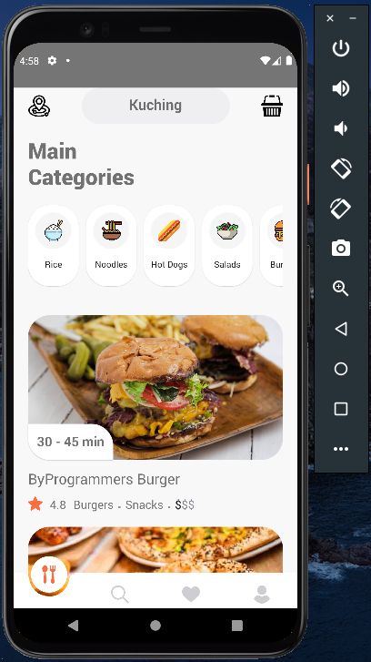
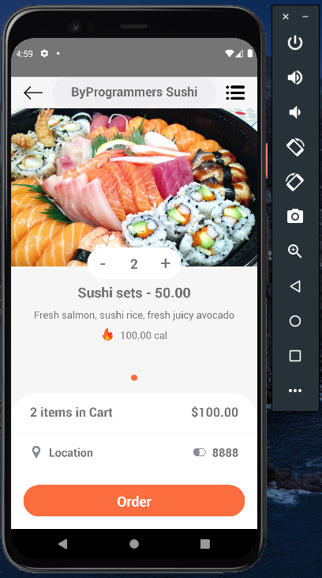

# FoodDeliveryApp
## This app is about the Food Delivery and it is based on React Native.
This app contains different screens for browsing the restaurants, dishes, order page and delivery screen(showing the location of delivery person and the user's home), which is preset in this build.
It also contains support for codepush and the app can be easily updated through AppCenter.

#### Screenshot: ``` Home Screen ```

<div align="center">

</ div>

#### ``` Order Screen ```

<div align="center">

</ div>

#### ``` Direction Screen ```

<div align="center">

</ div>

## Steps To Install The App

 1. Download the zip file on your device. (If you are using git you can also clone it)
 2. Extract it.
 3. Open the extracted folder in your editor eg. VS Code etc.
 4. Open terminal on the folder and run the commnad "npm install".
 5. If you have  an emulator already connected you can simply run the app using the command "npx react-native run-android" or "yarn android" (if you have yarn installed).

## Also you can transfer the apk from the zip file and run it on your device or emulator.
